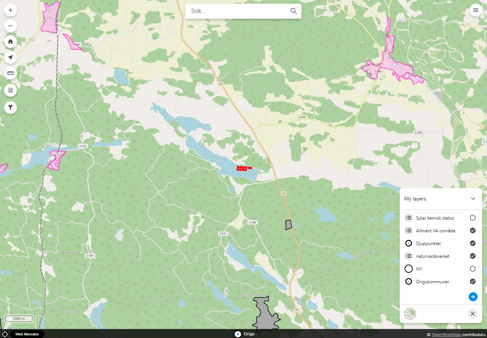

# origo-filter-etuna

Gränssnitt för att filtrera föremål i kartan.
ArcGIS-lager stöds inte för filtrering i dagsläget.

**OBS!**
För filtrering på WFS från Geoserver krävs att lagret eller dess source har loadingStrategy: **all**
```JS
"strategy": "all"
```

**Parametrar:**
- excludedAttributes: Egenskaper/attribut som inte ska listas i gränssnittet. **Valfri**.
- excludedLayers: Lager som inte ska listas i gränssnittet. Baseras på lagrets namn. **Valfri**.
- optionBackgroundColor: Bakgrundsfärg på filterade lager i lagerlistan. **Valfri**.
- filterPrefix: Prefix på filtrerade lager i lagerlistan. **Valfri**.
- indicatorBackgroundColor: Bakgrundsfärg för indikatorn på antal aktiva filter. **Valfri**.
- indicatorTextColor: Färg på texten för indikatorn på antal aktiva filter. **Valfri**.
- actLikeRadioButton: Om knappen i verktygslistan ska agera som radio-knapp eller inte. **Valfri**.
- tooltipText: Text som ska visas på verktygets tooltip. **Valfri**.
- warningTooltipText: Text som ska visas på attribut-varningens tooltip. **Valfri**.
- warningBackgroundColor: Bakgrundsfärg för attribut-varningen. **Valfri**.
- warningTextColor: Färg på texten för attribut-varningen. **Valfri**.
- warningText: Text som ska visas i attribut-varningen. **Valfri**.
- geoserverUrl: URL till Geoservers . Ex. https://localhost/geoserver. Denna måste vara angiven för att kunna hämta och mappa FTL till attribut. Både /geoserver/rest/layers och /geoserver/rest/workspaces måste vara tillgängligt för GET-anrop. **Valfri**.

**Material icons som används:**
- ic_delete_24px
- ic_edit_24px
- ic_visibility_24px
- ic_filter_24px

SVG för ic_visibility_24px
```HTML
  <symbol viewBox="0 0 24 24" id="ic_visibility_24px"><path d="M12 4.5C7 4.5 2.73 7.61 1 12c1.73 4.39 6 7.5 11 7.5s9.27-3.11 11-7.5c-1.73-4.39-6-7.5-11-7.5zM12 17c-2.76 0-5-2.24-5-5s2.24-5 5-5 5 2.24 5 5-2.24 5-5 5zm0-8c-1.66 0-3 1.34-3 3s1.34 3 3 3 3-1.34 3-3-1.34-3-3-3z"/></symbol>
```

SVG för ic_filter_24px
```HTML
  <symbol viewBox="0 0 24 24" id="ic_filter_24px"><path d="M14,12V19.88C14.04,20.18 13.94,20.5 13.71,20.71C13.32,21.1 12.69,21.1 12.3,20.71L10.29,18.7C10.06,18.47 9.96,18.16 10,17.87V12H9.97L4.21,4.62C3.87,4.19 3.95,3.56 4.38,3.22C4.57,3.08 4.78,3 5,3V3H19V3C19.22,3 19.43,3.08 19.62,3.22C20.05,3.56 20.13,4.19 19.79,4.62L14.03,12H14Z" /></symbol>
```

**Exempel:**
```HTML
<script type="text/javascript">
    var origo = Origo('index.json');
    origo.on('load', function (viewer) {
      var origofilteretuna = Origofilteretuna({
        excludedAttributes: ['geom', 'sokid'],
        excludedLayers: ['sokvyx_djupdata_djuppunkter_vy'],
        optionBackgroundColor: '#e1f2fe',
        filterPrefix: 'Filter - ',
        indicatorBackgroundColor: '#ff0000',
        indicatorTextColor: '#ffffff',
        actLikeRadioButton: false,
        tooltipText: 'Filter',
        warningTooltipText: 'Attribut med Å, Ä, Ö eller mellanslag kan inte användas för filtrering',
        warningBackgroundColor: '#fff700',
        warningTextColor: '#000000',
        warningText: 'OBS!',
        geoserverUrl: 'https://karta.eskilstuna.se/geoserver'
      });
      viewer.addComponent(origofilteretuna);
    });
</script>
```

### Demo filtrering

