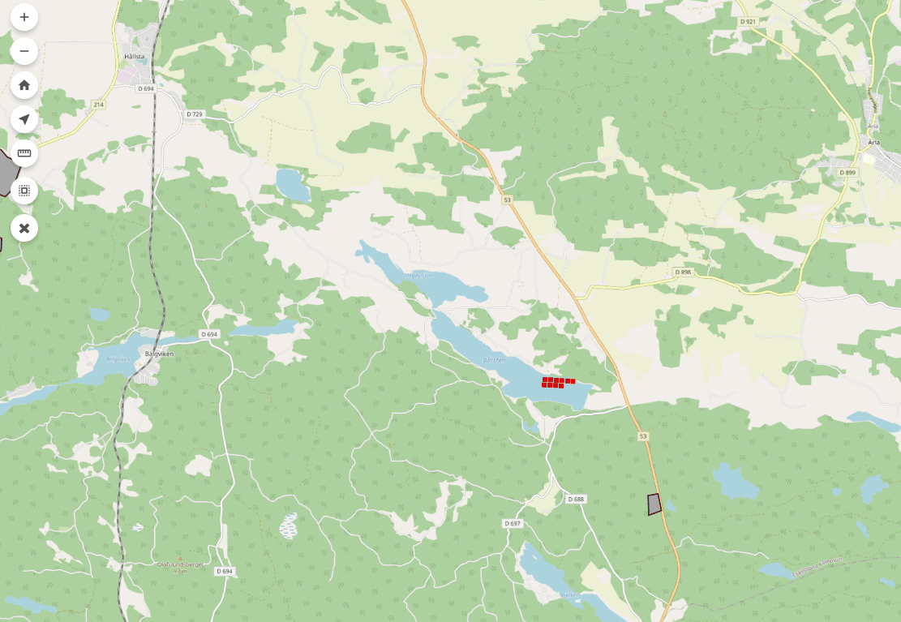

# origo-filter-etuna

Gränssnitt för att filtrera föremål i kartan.

**Parametrar:**
- excludedAttributes: Egenskaper/attribut som inte ska listas i gränssnittet. Valfri.

**Exempel:**
```HTML
<script type="text/javascript">
    var origo = Origo('index.json');
    origo.on('load', function (viewer) {
      var origofilteretuna = Origofilteretuna({
        excludedAttributes: ['geom', 'sokid']
      });
      viewer.addComponent(origofilteretuna);
    });
</script>
```

### Demo filtrering

