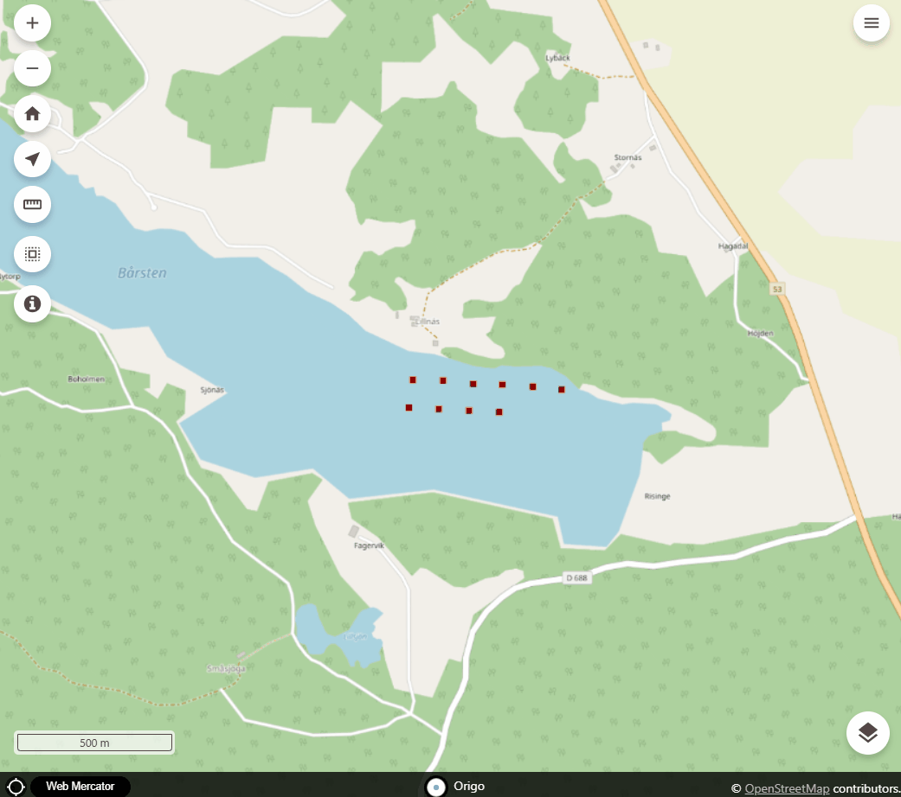

# origo-filter-etuna

Gränssnitt för att filtrera föremål i kartan.


**Exempel:**
```HTML
<script type="text/javascript">
    var origo = Origo('index.json');
    origo.on('load', function (viewer) {
      var origofilteretuna = Origofilteretuna();
      viewer.addComponent(origofilteretuna);
    });
</script>
```

### Demo filtrering
